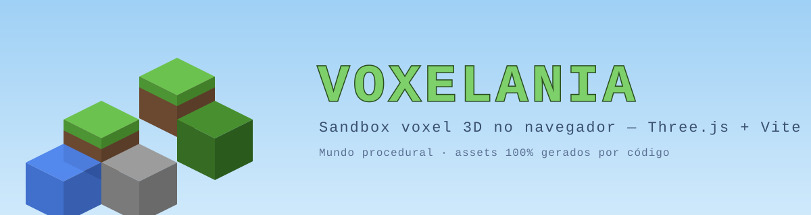

# Voxelania



Jogo sandbox de blocos (voxel) 3D que roda no navegador — engenharia no estilo
"Minecraft-like", com **conteúdo 100% original**: todas as texturas são geradas
proceduralmente em canvas, sem nenhum asset da Mojang/Microsoft.

### 🎮 Deploy no Netlify

O repositório já vem com um [`netlify.toml`](netlify.toml), então o Netlify
detecta tudo sozinho ao conectar o repo. Em **Add new site → Import from Git**,
as configurações já vêm preenchidas:

| Configuração         | Valor           |
| -------------------- | --------------- |
| Build command        | `npm run build` |
| Publish directory    | `dist`          |
| Node version         | `20`            |

Cada push na branch `main` dispara um novo deploy. O Netlify gera a URL pública
(algo como `https://seu-site.netlify.app`) — abra numa aba normal do navegador
(o pointer lock precisa de uma aba real).

## Como rodar

```bash
npm install
npm run dev
```

Abra http://localhost:5173 no navegador e clique em **"▶ Clique para jogar"**.

Build de produção: `npm run build` (saída em `dist/`, sirva com `npm run preview`).

## Controles

| Tecla / botão     | Ação                                          |
| ----------------- | --------------------------------------------- |
| `WASD`            | Mover                                         |
| Mouse             | Olhar (pointer lock)                          |
| `Espaço`          | Pular (no chão) / subir (voando)              |
| `Shift`           | Descer (voando)                               |
| `F`               | Alternar modo voo                             |
| Clique esquerdo   | Quebrar o bloco mirado                        |
| Clique direito    | Colocar o bloco selecionado na face mirada    |
| `1`–`7` / scroll  | Selecionar bloco na hotbar                    |
| `P`               | Salvar mundo + posição (localStorage)         |
| `ESC`             | Abrir o menu (pausa a física)                 |

O save também acontece automaticamente ao fechar/recarregar a página, e é
carregado automaticamente ao abrir. O botão **"Novo mundo"** no menu apaga o
save e gera tudo de novo.

## Arquitetura

```
src/
├─ main.js                  # entrada, wiring e loop principal
├─ core/
│  ├─ Engine.js             # cena, câmera, renderer, render loop, névoa
│  └─ Input.js              # teclado/mouse (estado contínuo + callbacks)
├─ world/
│  ├─ Block.js              # registro de tipos de bloco (sólido/opaco/líquido, tiles)
│  ├─ Chunk.js              # malha do chunk: 1 BufferGeometry mesclada, cull de faces
│  ├─ World.js              # load/unload de chunks, edições, persistência
│  └─ TerrainGenerator.js   # simplex-noise fBm → colinas, praias, mar, árvores
├─ player/
│  ├─ Player.js             # gravidade, colisão AABB eixo a eixo, voo
│  └─ Controls.js           # PointerLockControls + direção WASD
├─ interaction/
│  └─ Raycaster.js          # DDA de voxels: highlight, quebrar, colocar
├─ ui/
│  ├─ Hotbar.js             # slots com ícones recortados do atlas
│  ├─ Crosshair.js          # mira central
│  └─ DebugHUD.js           # FPS, posição, chunks carregados
└─ assets/
   └─ textures.js           # texture atlas procedural (canvas)
```

Pontos de engenharia:

- **Chunks 16×64×16**, uma `BufferGeometry` mesclada por chunk com apenas as
  faces visíveis (faces entre blocos opacos são descartadas). Água em malha
  transparente separada.
- **Texture atlas único** (64×64, 9 tiles de 16px) gerado em canvas com PRNG
  determinística; UVs por face com meio texel de margem contra sangria.
- **Iluminação fake** por orientação de face (topo claro, fundo escuro) nas
  cores de vértice — sem luzes na cena, rápido e com cara clássica de voxel.
- **Terreno determinístico por seed**: fBm de simplex-noise (4 octaves),
  camadas grama→terra→pedra, areia em praias, água até o nível do mar e
  árvores posicionadas por hash (máximo local em janela 5×5 → espaçamento
  garantido, copas atravessam bordas de chunk corretamente).
- **Frustum culling** automático por chunk (three.js) + névoa casada com a
  render distance p/ esconder o pop-in.
- **Persistência**: apenas o diff (blocos editados) + seed + posição/câmera do
  jogador vão para o localStorage — o resto regenera igual pela seed.

## TODOs / ideias futuras

- Greedy meshing (marcado com `// TODO: greedy meshing` em `src/world/Chunk.js`)
- Geração de malha em Web Worker p/ eliminar micro-stutter ao cruzar chunks
- Oclusão ambiente (AO) por vértice nos cantos dos blocos
- Sons procedurais (WebAudio) e ciclo dia/noite
